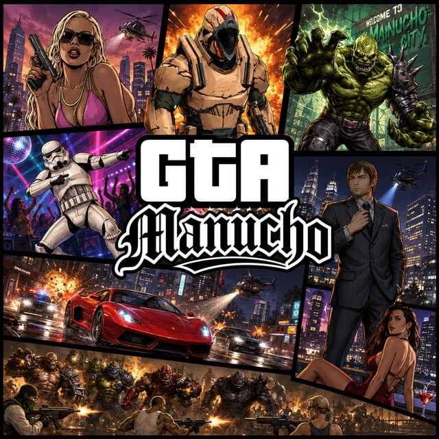

<div align="center">



# GTA MANUCHO

### Mundo abierto 3D que corre en el navegador · ARKEA AI

**Creado e integrado por Roberto Manuel Jara Peche**
GitHub: **[ma-nucho-pro](https://github.com/ma-nucho-pro)**

[Instagram](https://www.instagram.com/robertmanuchojp/) · [YouTube @ManuchoAI](https://www.youtube.com/@ManuchoAI) · [LinkedIn](https://www.linkedin.com/in/roberto-manuel-jara-peche-10867240b/)

**Versión V113** · Código abierto · Licencia MIT

</div>

---

## Qué es

Un juego de mundo abierto en 3D que se ejecuta entero dentro del navegador, sin
instalar nada y sin plugins. Es un sitio web estático: se abre y se juega.

Tiene ciudad, tráfico, peatones, policía con nivel de búsqueda, bandas, coches,
motos, barcos, balsas, helicópteros, aviones, tanques, caballos, propiedades que
se compran, mar abierto con natación, islas, puente Golden Gate, misiones
secundarias y modo online para jugar con amigos.

Está construido sobre [Three.js](https://threejs.org) y WebGL.

---

## Cómo ejecutarlo

El proyecto es estático. **No necesita compilación, ni Node, ni npm, ni ningún
archivo `.bat` o `.cmd`.**

### Opción 1 · Servidor local (recomendado)

Los navegadores bloquean los módulos de JavaScript abiertos con `file://`, así
que hace falta servir la carpeta. Con cualquiera de estos vale:

```bash
# Python (viene instalado en casi todo)
python3 -m http.server 8080

# Node
npx serve .

# PHP
php -S localhost:8080
```

Después abre <http://localhost:8080/juego/index.html>

### Opción 2 · GitHub Pages

Sube el repositorio, entra en *Settings → Pages*, elige la rama y la carpeta
raíz. El juego queda publicado en `https://TU-USUARIO.github.io/TU-REPO/juego/`.

### Opción 3 · Cualquier hosting estático

Netlify, Vercel, Cloudflare Pages, Firebase Hosting o un servidor propio.
Se sube la carpeta tal cual.

### Requisitos

- Un navegador con WebGL2: Chrome, Edge, Firefox, Opera o Brave actualizados.
- Ratón y teclado. Se recomienda pantalla completa.
- Funciona en equipos modestos: el juego mide los FPS reales y ajusta solo la
  resolución interna, la distancia de dibujado y el detalle.

---

## Controles

| Tecla | Acción |
|---|---|
| **W A S D** | Moverse |
| **Ratón** | Mirar |
| **Espacio** | Saltar · subir nadando |
| **Shift** | Correr · turbo en vehículo |
| **E** | Subir y bajar de cualquier vehículo |
| **V** | Cambiar de cámara (lejana, cercana, primera persona) |
| **Clic** | Disparar |
| **Tab** | Mapa completo (clic para marcar destino) |
| **Y** | Empezar o cancelar la misión del vehículo de servicio |
| **8** | Modo online |
| **F** | Acciones contextuales |

---

## Códigos

Se escriben con el teclado durante la partida, sin abrir nada y sin pulsar
Intro, como en los GTA clásicos. En cuanto las últimas letras coinciden, el
código se activa.

| Código | Qué hace |
|---|---|
| `MOTORA` | Trae una **moto** a tu lado |
| `TAXU` | Trae un **taxi** · habilita las misiones de taxi |
| `YUTA` | Trae un **coche patrulla** · habilita las misiones de policía |
| `PARAMEDIC` | Trae una **ambulancia** · habilita las misiones de ambulancia |

---

## Misiones secundarias

Sube al vehículo con **E** y pulsa **Y** para empezar. Pulsa **Y** otra vez para
cancelar. El objetivo aparece marcado en el radar y en el panel de la esquina.

- **Taxi** — Recoge al pasajero marcado y llévalo a su destino. **+$650**
- **Policía** — Persigue al ladrón marcado y detenlo. **+$1200**
- **Ambulancia** — Recoge al herido y llévalo al hospital. **+$900**

Los tres vehículos también aparecen por el mapa sin usar códigos; los códigos
son solo un atajo para tener uno a mano.

---

## Modo online

Se entra con la tecla **8**. Puedes ver a tus amigos moverse por la ciudad,
disparar, conducir y subirse contigo al mismo vehículo. Los aliados que reclutes
de tu banda también suben contigo a coches, barcos, motos y aeronaves.

Quien conduce es siempre quien manda sobre la física del vehículo: los pasajeros
solo van dentro. Es la decisión que evita que un vehículo compartido vibre o se
teletransporte entre las dos máquinas.

---

## Qué se ha ido mejorando

### Mundo

- **Islas del mar rehechas.** Antes eran un disco de arena naranja creado a mano
  que tapaba por completo el modelo real de la isla. Ahora la isla es ese modelo,
  con sus palmeras y sus rocas, elevado sobre el agua.
- **Se acabó flotar en el aire.** La colisión de las islas ya no es una fórmula
  aproximada: se rasterizan los triángulos reales del terreno en un campo de
  alturas. Donde no hay malla, no hay suelo.
- **Orillas físicas.** Nadando no se atraviesa la isla por debajo. Al acercarse a
  la playa el fondo sube y se pasa de nadar a caminar sin escalón.
- **Rocas generadas por SDF y marching cubes**, con cuatro niveles de detalle,
  impostores a distancia e instancing.
- **Puente Golden Gate** elevado por encima de las palmeras, con rampas que
  aterrizan sobre la arena de las islas.
- **Calzadas sobre el mar** donde las rutas de tráfico cruzaban agua.
- **Balsa navegable** que se conduce viendo al personaje encima.

### Rendimiento

Esta ha sido la parte más larga del trabajo. Lo que de verdad movió la aguja:

- **Un error que se lanzaba en cada fotograma.** Una función fuera de ámbito
  provocaba una excepción sesenta veces por segundo, y cada una imprimía su traza
  completa en la consola. Eso solo ya convertía el juego en una presentación de
  diapositivas.
- **Coches de 360.000 triángulos.** El motor creaba 150 instancias de un modelo
  de escaparate: **54 millones de triángulos por fotograma**, y el doble con el
  reflejo del agua. Un juego normal usa entre uno y tres millones. Ahora solo se
  dibujan los más cercanos.
- **Una fábrica de basura.** El código que elegía qué peatones dibujar creaba
  unos 250 objetos nuevos por fotograma. El recolector de basura para el mundo
  unos milisegundos cuando le apetece, y eso era el tirón al moverse.
- **Descarte por distancia que tiene en cuenta el tamaño** de cada objeto, con
  margen para que nada parpadee, y sin tocar nada que se mueva.
- **Precompilación de shaders** para que descubrir contenido nuevo no congele la
  pantalla.
- **Peticiones muertas bloqueadas.** El motor descargaba modelos de servidores
  que responden 404 o bloquean por CORS, y esperaba el viaje completo antes de
  usar su plan B.
- **Gobernador automático** que mide los FPS reales y ajusta resolución,
  distancia y detalle, con modo de emergencia si la cosa se pone fea.

### Corrección de fallos

- Los amigos del modo online ya no aparecen tumbados en el suelo al bajarse de un
  avión, ni caminan de espaldas.
- Los coches de NPC ya no circulan sobre el mar.
- El punto que marcas en el mapa se ve de verdad.
- La cámara cercana de la moto por fin es cercana.
- Los vehículos se hunden en el mar, chocan con los edificios y atropellan.

Cada versión tiene su archivo `CAMBIOS_GTA_MANUCHO_VXXX.txt` en la raíz, con la
explicación de qué fallaba y por qué.

---

## Diagnóstico

Con **F12** abierto, el juego imprime cada quince segundos una línea así:

```
[fluidez-v111] 47 fps · fotograma 21.3 ms (dibujo 8.1 ms = 38 %) ·
               96 llamadas · 162k triángulos · cuello: PROCESADOR
```

Sirve para saber dónde está el cuello de botella: si el reparto se va al dibujo,
sobra geometría o resolución; si no, sobran NPC o lógica.

Otras herramientas desde la consola:

```js
window.__V101_FRAME_BUDGET__.stats()   // FPS, llamadas, triángulos
window.__V106_MAR__.off()              // desactiva la detección de mar
window.__V113_CODIGOS__.activate('TAXU')
```

---

## Estructura

```
.
├── juego/
│   ├── index.html              punto de entrada
│   ├── assets/                 motor del juego
│   ├── marine-assets/          modelos del mar y las islas
│   ├── skin-assets/            personajes y bandas
│   ├── bosque/ desert/ castillo/ mundo-barco/ coliseo/ arcade/
│   └── *.js                    módulos de mejoras
├── docs/media/                 capturas y clips
├── README.md
├── LICENSE
├── NOTICE.md
├── CONTRIBUTING.md
└── CAMBIOS_GTA_MANUCHO_*.txt   historial de cambios
```

---

## Código abierto

El código original de este proyecto se publica bajo **licencia MIT**. Puedes
estudiarlo, usarlo, modificarlo y compartirlo, incluso con fines comerciales.

La única condición es **conservar el aviso de copyright, el archivo `LICENSE`,
el archivo `NOTICE.md` y los créditos** a:

> **Roberto Manuel Jara Peche** — ARKEA AI — GitHub [ma-nucho-pro](https://github.com/ma-nucho-pro)

Las bibliotecas, modelos, texturas, sonidos y tipografías de terceros conservan
sus propias licencias y autores. Están detallados en [NOTICE.md](NOTICE.md).

Three.js se distribuye bajo licencia MIT, copyright de sus autores.

Si quieres contribuir, lee [CONTRIBUTING.md](CONTRIBUTING.md).

---

## Aviso

Proyecto independiente, personal y sin ánimo de lucro, hecho como ejercicio de
desarrollo web y 3D. **No está afiliado, patrocinado ni respaldado por Rockstar
Games ni por Take-Two Interactive.** «Grand Theft Auto» y «GTA» son marcas
registradas de sus respectivos propietarios. El nombre de este proyecto es un
homenaje personal del autor, no un producto oficial ni un intento de sustituirlo.

---

<div align="center">

**GTA MANUCHO** · Roberto Manuel Jara Peche · ARKEA AI

</div>
