<div align="center">


# GTA MANUCHO ONLINE V92

### Mundo abierto 3D multijugador para navegador · ARKEA AI

**Online GTA-style open-world game generated with AI from a single prompt.**  
**Built with ChatGPT 5.6, Gemini 3.5 Pro, Mythos, and Fable 5.**

**Creado e integrado por Roberto Manuel Jara Peche**  
GitHub: **[ma-nucho-pro](https://github.com/ma-nucho-pro)**

[Instagram](https://www.instagram.com/robertmanuchojp/) · [YouTube ma-nucho / @ManuchoAI](https://www.youtube.com/@ManuchoAI) · [LinkedIn](https://www.linkedin.com/in/roberto-manuel-jara-peche-10867240b/)

</div>

## Sobre el juego

**GTA MANUCHO ONLINE** es un juego 3D de mundo abierto que funciona directamente en el navegador. Incluye una ciudad explorable, personajes, NPC, tráfico, policía, bandas, coches, bicicletas, barcos, jets, aviones, helicópteros, tanques, propiedades, combate, cámaras en primera y tercera persona, mar, islas y diferentes mundos secundarios.

La versión **V92** convierte la experiencia en un mundo multijugador conectado mediante **Supabase Realtime**. Los jugadores pueden crear o compartir un código de sala, entrar al mismo servidor y encontrarse dentro del juego sin instalar un cliente adicional.

> Pulsa **O** durante la partida para abrir el panel de **GTA MANUCHO ONLINE**.

## Ahora es online

El modo online permite:

- Crear o unirse a una sala mediante un código compartido.
- Elegir el nombre y el color del personaje.
- Ver a los demás jugadores con su nombre sobre la cabeza.
- Sincronizar posición, movimiento, rotación y animaciones `Idle`, `Walk` y `Run`.
- Ver a otros jugadores caminando en la dirección correcta.
- Mostrar jugadores online en el radar y en el mapa.
- Sincronizar coches, jets, aviones, helicópteros, tanques y barcos.
- Ver vehículos generados mediante trucos a escala real.
- Compartir policía, disparos, combate y estados del mundo.
- Encontrarse en la ciudad, el mar, las islas, el bosque, el museo, el coliseo, el castillo, el desierto, el salón arcade y otros mundos del juego.

La comunicación multijugador utiliza canales de **Supabase Realtime**, presencia para detectar jugadores conectados y eventos de difusión para compartir los estados de la partida.

## Cómo jugar online

1. Abre el juego desde GitHub Pages o desde un servidor local.
2. Inicia la partida normalmente.
3. Pulsa la tecla **O**.
4. Escribe tu nombre.
5. Selecciona el color de tu personaje.
6. Introduce un código de servidor, por ejemplo:

```text
MANUCHO
```

7. Pulsa **JUGAR ONLINE**.
8. Comparte el mismo código con tus amigos.

Los jugadores que usen el mismo código entrarán en la misma sala.

## Clips del juego

<p align="center">
  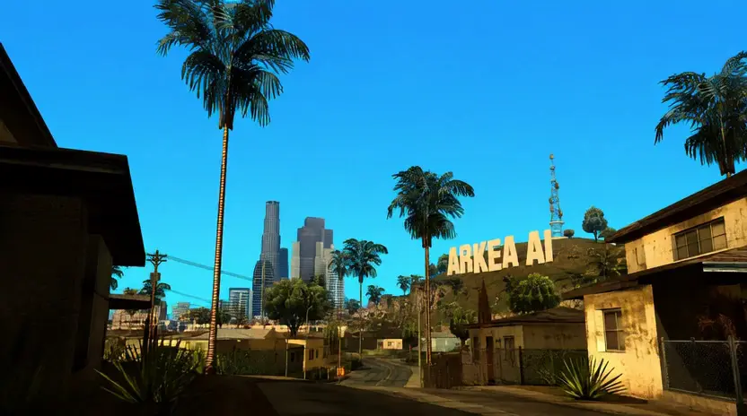
  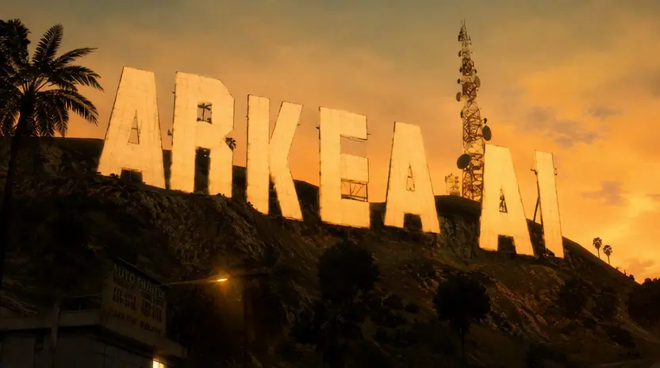
  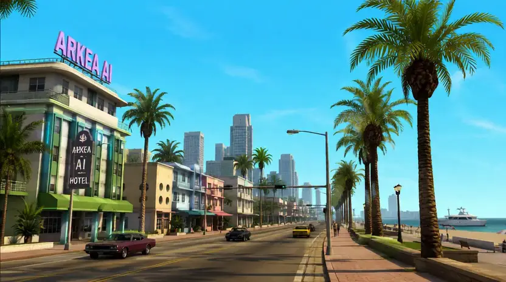
</p>

## Capturas

<p align="center">
  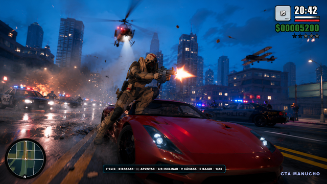
  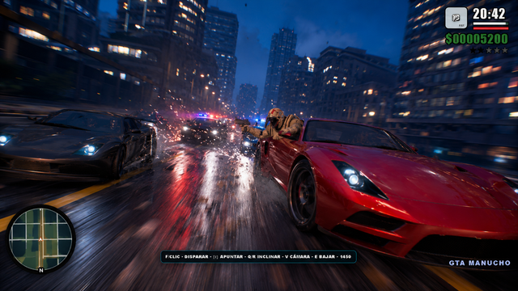
</p>

<p align="center">
  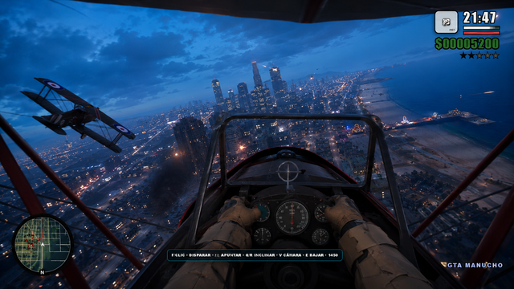
  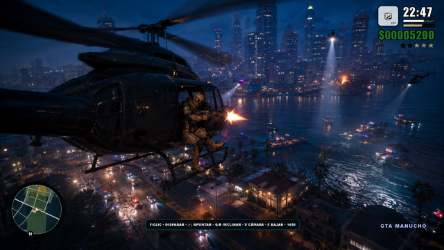
</p>

<p align="center">
  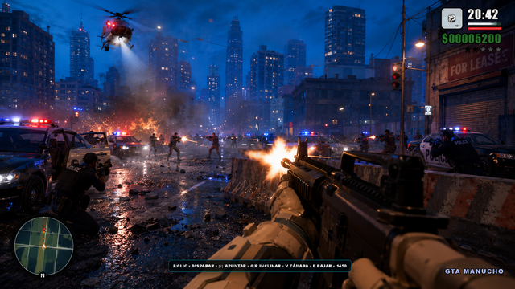
  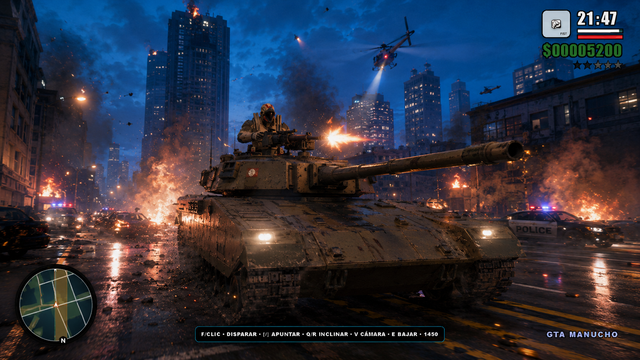
  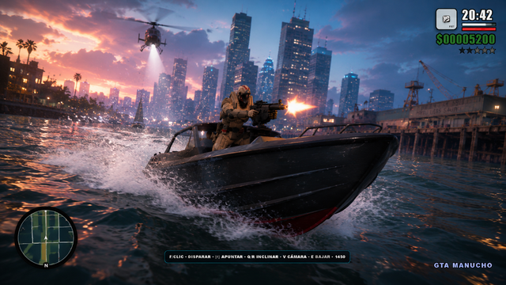
</p>

<details>
<summary>Ver más capturas</summary>

<p align="center">
  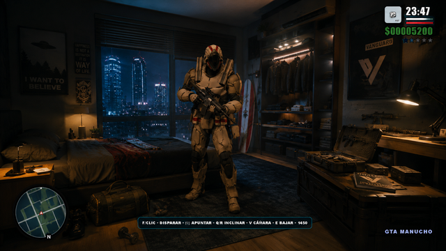
  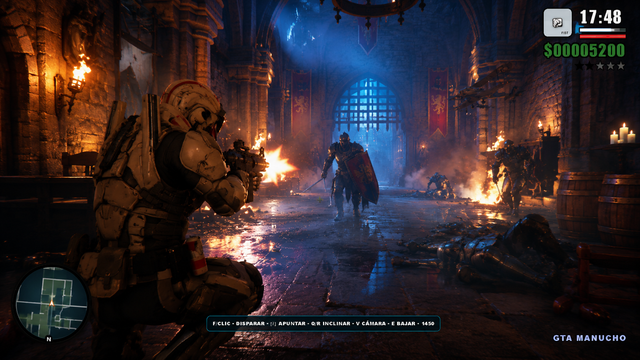
  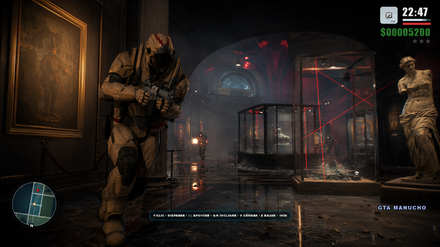
</p>

</details>

## Cambios principales de la V92

### Multijugador

- Personajes remotos con el modelo original `Soldier.glb`.
- Animaciones remotas de reposo, caminata y carrera.
- Corrección del giro que hacía caminar al otro jugador de espaldas.
- Posición y rotación online actualizadas con alta frecuencia.
- Nombres y colores personalizados para cada jugador.
- Salas privadas mediante códigos compartidos.
- Sincronización de jugadores, disparos, policía y combate.
- Marcadores de otros jugadores en el radar y el mapa.

### Vehículos online

- Coches, jets, aviones, helicópteros, tanques y barcos visibles para todos los jugadores.
- Vehículos remotos con tamaño y escala reales.
- Sincronización de posición, rotación y conducción.
- Vehículos generados mediante trucos visibles para los demás jugadores.
- Precarga de modelos y shaders para evitar congelaciones al aparecer.

### Mundo y rendimiento

- Cámara de natación baja y cercana al personaje.
- Vehículos bloqueados al intentar entrar al agua.
- Recuperación automática del Parque del Retiro si falla durante la carga.
- Mayor cantidad de NPC y coches mediante sistemas instanciados.
- Resolución adaptativa para mantener una experiencia fluida.
- Carga escalonada de sistemas secundarios y compilación anticipada de shaders.

## Tecnologías

- **Three.js** para el mundo 3D y la renderización en el navegador.
- **JavaScript ES Modules** para los sistemas del juego.
- **GLTF / GLB** para personajes, vehículos y escenarios.
- **Supabase Realtime** para presencia, salas y sincronización multijugador.
- **GitHub Actions** para generar la configuración de despliegue.
- **GitHub Pages** o cualquier hosting web compatible con HTTPS.

## Publicar en GitHub Pages

### 1. Repositorio

El repositorio recomendado es:

```text
GTA-MANUCHO-ONLINE
```

Dirección del proyecto:

```text
https://github.com/ma-nucho-pro/GTA-MANUCHO-ONLINE
```

### 2. Subir el proyecto completo

Debes subir todo el contenido del proyecto, conservando la estructura:

```text
assets/
docs/
juego/
menu-animations/
.github/
index.html
README.md
LICENSE
NOTICE.md
```

El archivo principal es `index.html`. El juego también puede abrirse directamente desde:

```text
juego/index.html?noprogressive=1
```

### 3. Configurar Supabase de forma segura

No subas tu configuración local real de Supabase.

El archivo privado es:

```text
juego/supabase-config.local.js
```

Este archivo está incluido en `.gitignore` y no debe aparecer en GitHub.

En el repositorio abre:

```text
Settings → Secrets and variables → Actions
```

Crea estos secretos:

```text
SUPABASE_URL
SUPABASE_ANON_KEY
```

Utiliza únicamente una clave **anon** o **publishable** para el cliente web. Nunca uses una clave `service_role` o `sb_secret_...` dentro del juego.

### 4. Activar GitHub Pages

Abre:

```text
Settings → Pages → Build and deployment → Source → GitHub Actions
```

El workflow:

```text
.github/workflows/deploy-pages.yml
```

genera la configuración de Supabase durante el despliegue y publica el proyecto después de cada cambio enviado a la rama `main`.

### 5. Abrir el juego

La dirección esperada será:

```text
https://ma-nucho-pro.github.io/GTA-MANUCHO-ONLINE/
```

## Probarlo localmente

### 1. Crear la configuración local

Dentro de `juego/`, copia:

```text
supabase-config.example.js
```

como:

```text
supabase-config.local.js
```

Completa la URL y la clave anon de tu proyecto Supabase.

### 2. Iniciar un servidor local

La forma más sencilla es abrir la carpeta con Visual Studio Code, instalar la extensión **Live Server** y pulsar **Go Live**.

También puedes utilizar cualquier servidor HTTP local. Los módulos JavaScript y los modelos 3D deben cargarse mediante `http://` o `https://`; abrir el proyecto directamente con `file://` puede bloquear recursos del navegador.

## Controles principales

| Acción | Control |
|---|---|
| Abrir o cerrar el modo online | O |
| Moverse | W, A, S, D o flechas |
| Correr / nadar más rápido | Shift |
| Saltar / subir en el agua | Espacio |
| Sumergirse | Mantener clic del ratón |
| Interactuar / subir o bajar | E |
| Cambiar cámara | V |
| Cámara alternativa de vehículo | C |
| Reiniciar cámara | R |

Los controles adicionales aparecen dentro de la interfaz según el vehículo, arma o zona activa.

## Estructura técnica

```text
GTA-MANUCHO-ONLINE/
├── index.html
├── startup-intro.js
├── project-credits.js
├── assets/
├── docs/media/
├── menu-animations/
├── juego/
│   ├── index.html
│   ├── gta-manucho-online.js
│   ├── mejoras-v92.js
│   ├── marine-world-v84.js
│   ├── performance-boost.js
│   ├── supabase-config.example.js
│   ├── supabase-config.local.js       # Privado e ignorado por Git
│   ├── libs/supabase.esm.js
│   ├── assets/index-CXrFrkSv.js
│   └── models, vehículos y mundos 3D
├── .github/workflows/deploy-pages.yml
├── .gitignore
├── LICENSE
└── NOTICE.md
```

## Seguridad de Supabase

La clave anon o publishable permite conectar el juego web con Supabase, pero no sustituye la seguridad del backend. Las tablas, canales y demás recursos deben protegerse mediante las políticas correspondientes de Supabase.

Nunca publiques:

- Claves `service_role`.
- Claves `sb_secret_...`.
- Contraseñas de base de datos.
- Tokens privados.
- Archivos `.env` reales.

## Rendimiento

La V92 prepara en segundo plano los modelos online más importantes, incluyendo personajes, coches, aeronaves y tanques. También compila sus shaders en momentos de menor carga para reducir tirones cuando otro jugador utiliza un vehículo por primera vez.

La resolución se adapta automáticamente cuando disminuyen los FPS. La población de peatones y coches usa instancias para mostrar más actividad sin crear una cantidad equivalente de llamadas de renderizado.

## Inteligencia artificial utilizada

Este proyecto fue desarrollado y ampliado con herramientas de inteligencia artificial a partir de instrucciones y prompts del creador.

Herramientas indicadas para el proyecto:

- **ChatGPT 5.6**
- **Gemini 3.5 Pro**
- **Mythos**
- **Fable 5**

La dirección creativa, integración, pruebas y evolución del juego corresponden a **Roberto Manuel Jara Peche**.

## Autor y redes oficiales

**Roberto Manuel Jara Peche**  
Creador e integrador de **GTA MANUCHO ONLINE**  
Marca: **ARKEA AI / Manucho**  
GitHub: **[ma-nucho-pro](https://github.com/ma-nucho-pro)**  
Instagram: **[robertmanuchojp](https://www.instagram.com/robertmanuchojp/)**  
YouTube: **[ma-nucho · @ManuchoAI](https://www.youtube.com/@ManuchoAI)**  
LinkedIn: **[Roberto Manuel Jara Peche](https://www.linkedin.com/in/roberto-manuel-jara-peche-10867240b/)**

## Licencia y uso

El código original creado para este proyecto se distribuye bajo la licencia MIT. Puedes estudiar, usar, modificar y compartir el código, pero debes conservar el aviso de copyright, el archivo `LICENSE`, el archivo `NOTICE.md` y los créditos a:

```text
Roberto Manuel Jara Peche
GitHub: ma-nucho-pro
ARKEA AI / Manucho
```

Las bibliotecas, modelos, texturas, sonidos, tipografías y demás recursos de terceros conservan sus respectivas licencias y autores. Consulta [LICENSE](LICENSE) y [NOTICE.md](NOTICE.md).

---

<div align="center">

**GTA MANUCHO ONLINE V92 · HECHO POR ROBERTO MANUEL JARA PECHE · ARKEA AI**

</div>
